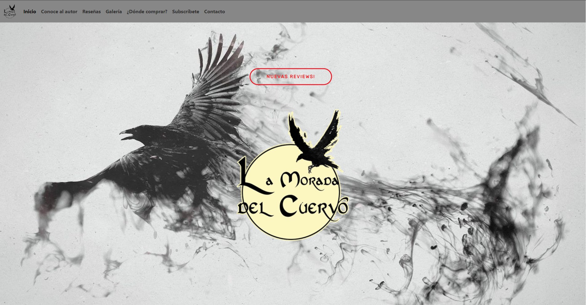
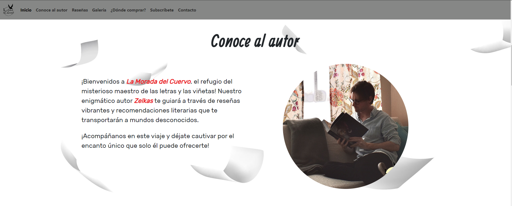
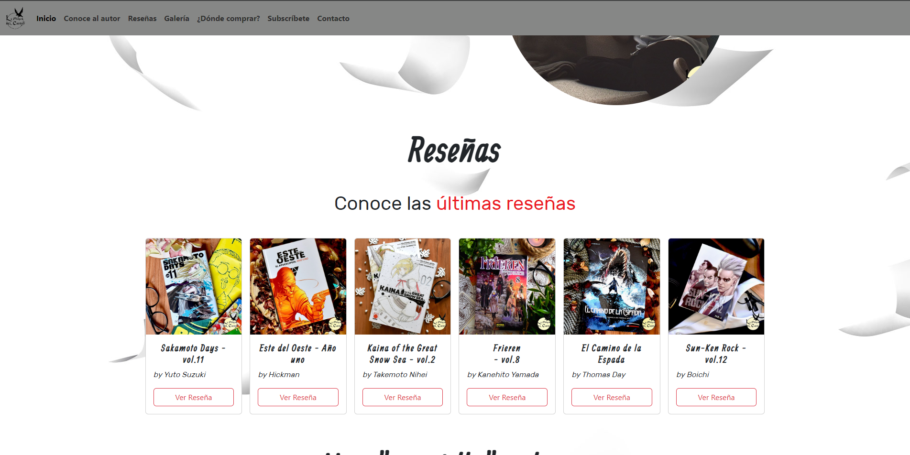
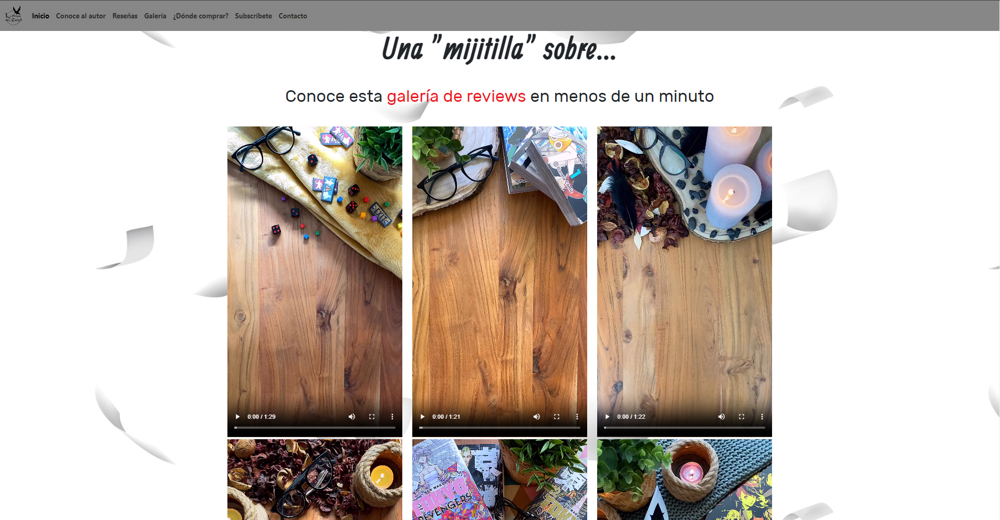
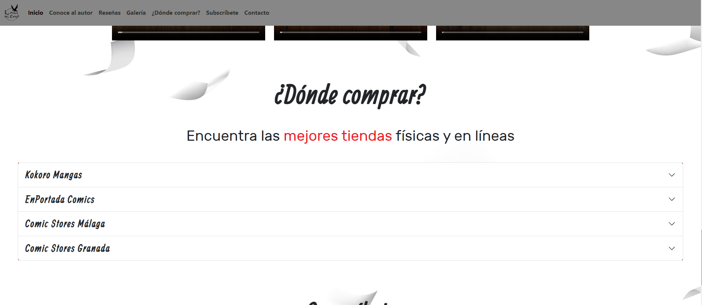
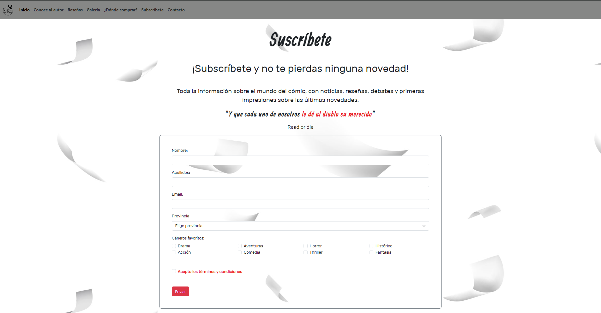
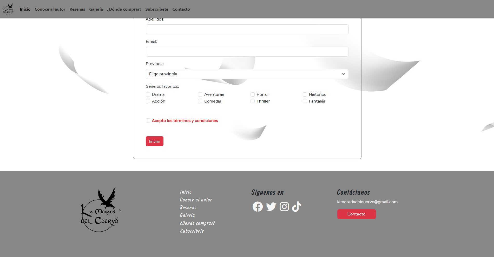

<h1>Memoria del proyecto</h1>
<h2>Web - La Morada del Cuervo</h2>

Enlace directo a web navegable:

- <a href="https://antcordero.github.io/LaMoradaDelCuervo/landingpage.html" target="_blank">Web navegable del proyecto</a>
<h2>Índice</h2>
<ul>
  <li><a href="#introduccion">Introducción</a></li>
  <li><a href="#motivacion">Motivación</a></li>
  <li><a href="#estructura">Estructura</a></li>
  <li><a href="#estilo">Estilo</a></li>
</ul>

<h2 id="introduccion">Introducción</h2>

Trabajo realizado por: Antonio Cordero

Febrero de 2024

Licencia CC-BY

<h2 id="motivacion">Motivación</h2>

Creación de una web tipo portfolio y blog para las RRSS de reseñas de mangas y cómics que lleva mi profesor de academia de idiomas Campus 3 Alhaurín de la Torre.

<b>Motivo:</b> Hace tiempo que mi profesor de C2 de inglés y B1 francés hace reseñas de cómics y mangas, de los cual es un gran fan, tanto en Instragram como en Tiktok, por lo que hacerle una web específica le daría mucha versatilidad.

<h2 id="estructura">Estructura</h2>

La web está dividida en  X secciones:

<ul>
  <li>Hero Section</li>  
  <li>Conoce al autor</li>
  <li>Reseñas</li>
  <li>Galería</li>
  <li>¿Dónde comprar?</li>
  <li>Subscíbete</li>
  <li>Footer</li>
</ul>

<h3>Hero Section</h3>

He utilizado dos imágenes de fondo tomadas de Pinterest, una imagen se adapta a pantallas grandes (portátil, sobremesa), por otro lado la otra se adapta a pantallas pequeñas (móvil y tablet) 
Sobre ella he colocado un botón "Call to Action" estilados de forma sencilla

Por otro lado, todo el cuerpo de la web cuenta con una imagen de fondo a modo de patrón

<h3>Conoce al autor</h3>

Texto corto a modo de presentación inicial donde se explica el mótivo de la web. Título inicial central, texto centrado a la izquierda y una imagen recortada circularmente a la derecha, ambos dejando márgenes al wrapper.

La imagen utilizado se ha usado con el consentimiento del autor.

<h3>Reseñas</h3>

Se muestran varias de la últimas reseñas en formato de cards, cada una con un botón que enlaza a cada de las reseñas en el instragram oficial de la cuenta.

<h3>Galería</h3>

Galería de vídeos en formato de grid 3x3, sobre una sección llamada "Una 'mijitilla' sobre ..." donde son vídeos en un formato rápido de vídeos cortos de menos de un minuto

<h3>¿Dónde comprar?</h3>

Elemento accordion donde dentro de cada uno se muestra información sobre varias tiendas físicas especializadas en la venta de cómics, mangas y demás merechandising del género. Además se enlaza cada web oficial en un botón simpple y junto a todo esto un mapa embebido de Google Maps donde se muestra la dirección.

<h3>Subscríbete</h3>

Formato de Introducción de datos, email y chequeo de opciones con la intención de que quien quiera se pueda subscribir para recibir noticias de la web.

Cuenta con un modal a modo de ventana emergernte para los términos y condiciones de privacidad y uso de la infomación proporcionada del usuario que se registre.

<h3>Footer</h3>

Footer que cuenta con elementos extilados con grid-22 y un segundo grid-1 al final de la página para los el contacto y de la barra de navegación secundaria y copyright. Se muestra un fondo de color sólido y el lógo como grid.

<h2 id="estilo">Estilo de la página</h2>
<h3>Paleta de colores</h3>

 
  <li>primary-color: #f5f5f5; Artic White</li>
  <li>secondary-color: #ec1a24; Sun Blaze Red</li>
  <li>terciary-color: #868786; Dark Silver</li>

<h3>Tipografías</h3>

  <li>Títulos: Allan Regular from 1001fonts</li>
  <li>Texto: Rubik Regular from 1001fonts</li>

<h3>Imágenes</h3>

  <ul>
    <li><a href="https://www.pinterest.es/pin/126171227053892647/">Imagen utilizada para la hero section</a></li>
    <li>Tanto la imagen de fondo como el logo de la web han sido creados y editados por mi utilizando Phosotshop CS6 y Illustrator CC 2023</li>
    <li>El resto de fotografías y vídeos han sido cedidos por el mismo autor de las reseñas desde su cuenta de Instragram.</li>
  </ul>

<h2 id="snippets">Code snippets</h2>

He utilizado los siguientes:

<ul>
  <li>Barra de navegación: customizada a partir de la disponible en la web de GetBootStrap (<a href="https://getbootstrap.com/docs/5.3/components/navbar/#how-it-works">Web de referencia</a>)</li>
  <li>Cards customizadas a partir de la disponible en la web de GetBootStrap (<a href="https://getbootstrap.com/docs/5.3/components/card/#about">Web de referencia</a>)</li>
  <li>Elemento Accordion customizado a partir del dispnible en la web de GetBootStrap" (<a href="https://getbootstrap.com/docs/5.3/components/accordion/#how-it-works">Web de referencia</a>)</li>
  <li>Input y Validation Form y Modal customizados a partir de los disponibles en la web de GetBootStrap (<a href="https://getbootstrap.com/docs/5.3/components/modal/">Web de referencia</a>)</li>
  <li>Botón BootStrap editado a partir de disponible en CodePen del autor "Georgios Tsirigos"(<a href="https://codepen.io/georgiostsirigos/pen/ObMaXa">url</a>)</li>
</ul>
